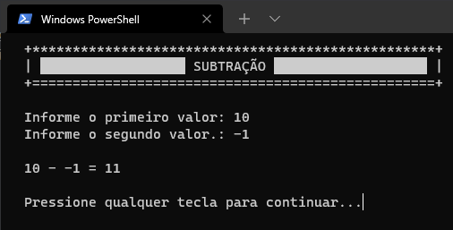
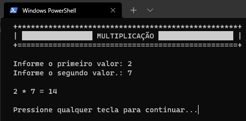
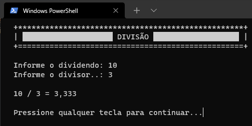
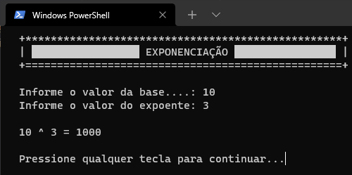
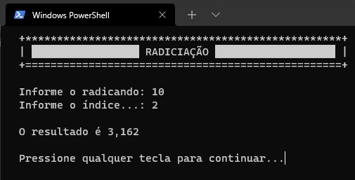

# Projeto final de DevCSharp

Este programa disponibiliza uma interface para execução de operações matemáticas disponíveis no mesmo.

## Exemplo

Tela Inicial - Primeira Página


Tela Inicial - Segunda Página


Exemplo de Soma


Exemplo de Subtração



Exemplo de Multiplicação



Exemplo de Divisão



Exemplo de Exponenciação



Exemplo de Radiciação



Créditos


## Documentação

Este projeto foi realizado para execução em console, sem utilização de Programação Orientada a Objetos, então não estranhe que ele é gigantesco 🙃

Guia básico de navegação:
- Para escolher alguma opção basta digitar o número referente para a funcionalidade escolhida (1 à 8);
- Caso queira passar para a próxima página digite 9;
- Caso queira sair do programa digite 0.

Outras informações:
- Caso ocorra algum problema durante a execução do programa será exibido uma mensagem, com o contexto do problema e a execução será pulada, retornando para a página acessada antes da execução daquela funcionalidade.

## _Download_

Baixe o arquivo abaixo. Descompacte na pasta desejada.

[🗃 Download do arquivo .zip](dist/Projeto2021_2.zip)

Execute utilizando o comando:

```
dotnet Projeto2021_2.dll
```

Ou, se você estiver no Windows, pode dar um duplo-clique no ícone do programa.

## Agradecimentos

- Prof. Ermogenes
- Prof. Diego Neri

---

É sobre isso...
